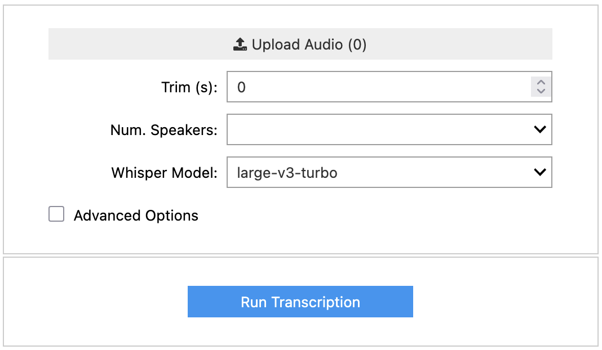

# ghe_transcribe

[](https://www.python.org/downloads/)
[](https://opensource.org/licenses/MIT)
[](https://renkulab.io/p/nmassari/ghe-transcribe)

A tool to transcribe audio files with speaker diarization using **Faster Whisper** and **Pyannote**.

## Quick Start

**Run online without installation**: [Launch on RenkuLab](https://renkulab.io/p/nmassari/ghe-transcribe)

<details>
<summary>Interface Preview</summary>

The Jupyter-based interface provides an intuitive way to upload audio files, configure transcription settings, and download results in multiple formats.



</details>

## Installation

### System Dependencies

This tool requires FFmpeg for audio processing:

```bash
# macOS
brew install ffmpeg

# Ubuntu/Debian
sudo apt update && sudo apt install ffmpeg

# Windows
choco install ffmpeg
```

### Python Package

```bash
git clone https://github.com/Global-Health-Engineering/ghe_transcribe.git
cd ghe_transcribe
pip install -e .
```

For Euler cluster or development setup, see the [detailed installation guide](docs/INSTALLATION.md).

## Hugging Face Authentication

This tool uses gated models from Hugging Face that require authentication. You need to:

1. **Join Hugging Face**: [huggingface.co/join](https://huggingface.co/join)
1. **Accept User Conditions**: You must accept conditions for BOTH models:
   - [https://hf.co/pyannote/speaker-diarization-3.1](https://hf.co/pyannote/speaker-diarization-3.1)
   - [https://hf.co/pyannote/speaker-diarization-community-1](https://hf.co/pyannote/speaker-diarization-community-1)
2. **Create Access Token**: Visit [https://hf.co/settings/tokens](https://hf.co/settings/tokens) to create a new access token with read permissions


## Usage

### Live build on Renkulab
1. Open [https://renkulab.io/p/nmassari/ghe-transcribe](https://renkulab.io/p/nmassari/ghe-transcribe)
2. Click "Launch"
3. Add your Hugging Face token when prompted (see [authentication section](#hugging-face-authentication))
4. Open and run `app.ipynb`

### Jupyter Interface (Local)
Open `app.ipynb` and run the cell:
```python
from ghe_transcribe.app import execute
execute()
```

### Python API
```python
from ghe_transcribe.core import transcribe
result = transcribe("media/test01.mp3")
```

### Command Line
```bash
# Simplest call
transcribe media/test01.mp3

# Multiple files
transcribe media/test01.mp3 media/test02.m4a --trim 5

# See all options
transcribe --help 
```

## Key Features

- **Fast transcription** with optimized Whisper models
- **Speaker diarization** to identify different speakers
- **Multiple output formats** (TXT, SRT)
- **Jupyter interface** for interactive use
- **CLI tool** for batch processing

## Editors

- **For SRT files** [subtitle-editor.org/](https://subtitle-editor.org/), runs locally on your browser
- **For TXT files** note-taking apps, Word, MAXQDA, QualCoder, ...

## Contributing

We welcome contributions! Please use [conventional commits](https://www.conventionalcommits.org/en/v1.0.0/).

## License

MIT License - see [LICENSE](LICENSE) for details.
